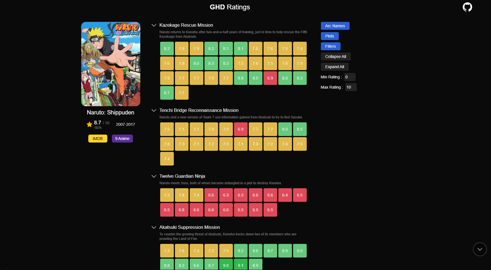
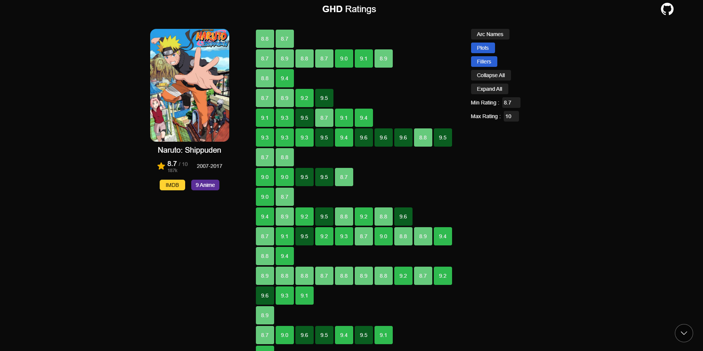
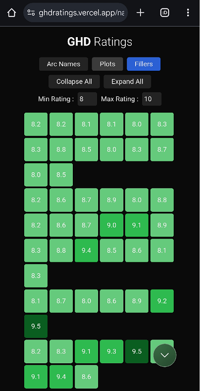

# GHD Ratings

A Feature-rich episode ratings browser web-app targeting Naruto & Naruto Shippuden.

Similar websites like [tvcharts](https://tvcharts.co/show/naruto-tt0409591) struggle with long-running shows like Naruto and Naruto Shippuden, which have a large number of episodes and multiple story arcs. This project aims to provide a much better experience browsing episode ratings for these shows.

View the website here: [ghdratings.vercel.app](https://ghdratings.vercel.app/)

[click here to watch a video of the app in action](https://youtu.be/3QD494adz88)

## Features

- Seperate episodes by arcs
- Display a quick summary of each arc
- Browse episode ratings for Naruto and Naruto Shippuden
- Filter *Filler* episodes
- Filter episodes by rating (min and max)
- View episode details on IMDB and 9anime
- Customizable episode view (show arc names, show plots, show fillers)
- *Scroll-to-top* button with memory :)

## Tech

- [React](https://reactjs.org/)
- [Next.js](https://nextjs.org/)
- [Tailwind CSS](https://tailwindcss.com/)
- [TypeScript](https://www.typescriptlang.org/)

## Data

Data for this project is scraped from IMDB and animefillerlist.com. The data is stored in the `data` folder.

## Demos

- Filtering in action

    

- Mobile view

    

## Credits

- [Anime-FillerList](https://www.animefillerlist.com/)
- [9animeTV](https://9animetv.to/)
- [IMDb](https://www.imdb.com/)
- [tvcharts](https://tvcharts.co/)

By Gholamreza Dar 2025
